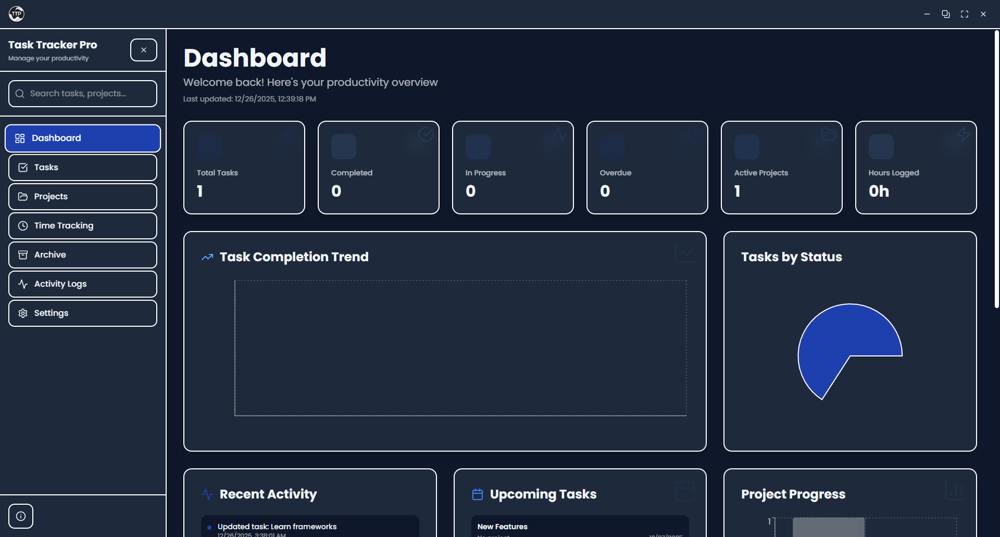
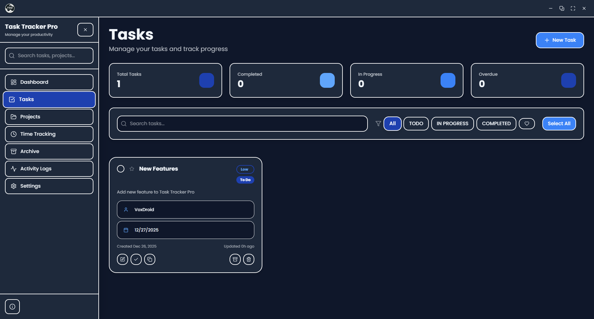
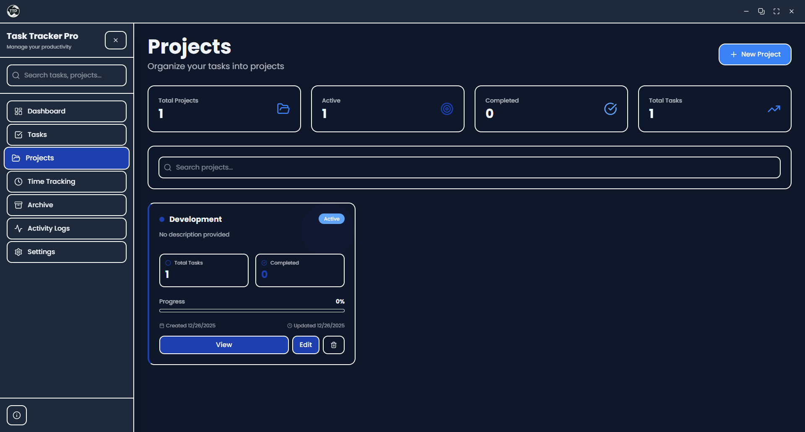
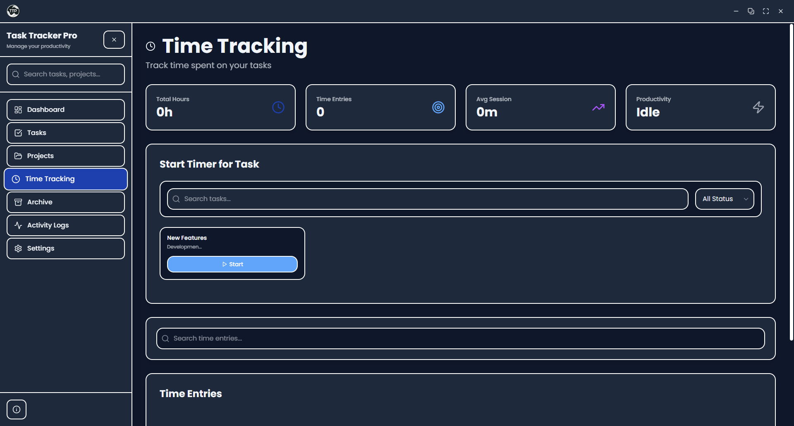
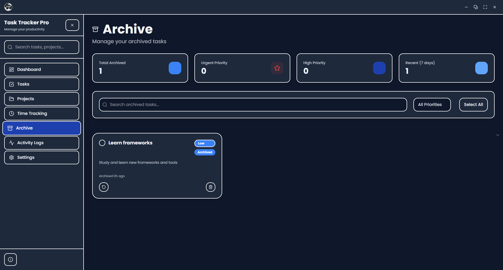
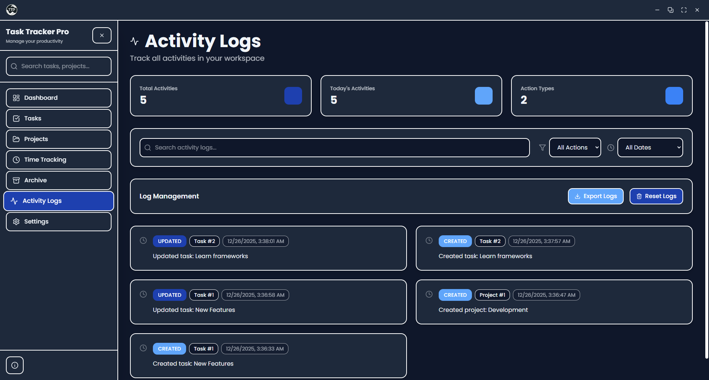
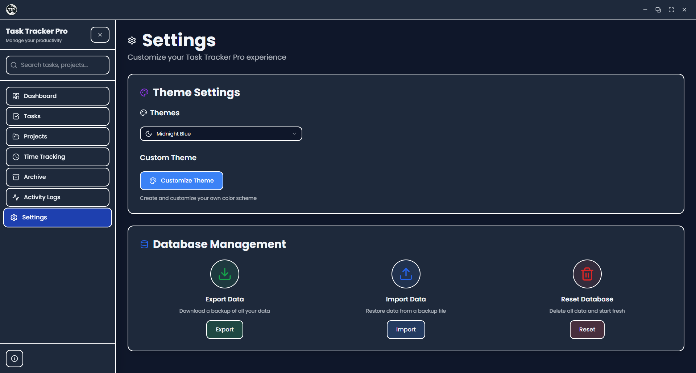

<p align="center">
  
</p>

<h1 align="center">Task Tracker Pro</h1>

<p align="center">
  A simple, clean task tracking and personal productivity application built with Next.js and Electron.
</p>

<p align="center">
  <a href="#features">Features</a> •
  <a href="#screenshots">Screenshots</a> •
  <a href="#installation">Installation</a> •
  <a href="#usage">Usage</a> •
  <a href="#development">Development</a> •
  <a href="#contributing">Contributing</a> •
  <a href="#license">License</a>
</p>

---

## Overview

Task Tracker Pro is a lightweight personal productivity application designed for individuals who want a simple way to manage their daily tasks, personal projects, and track how they spend their time.

Built as a cross-platform desktop application, it runs on Windows, macOS, and Linux. All your data is stored locally in a SQLite database on your computer - no accounts, no cloud sync, no subscriptions. Your data stays private and works completely offline.

---

## Features

### What You Can Do

| Feature | Description |
|---------|-------------|
| **Task Management** | Create and organize your tasks with priorities, due dates, and notes |
| **Project Organization** | Group related tasks into projects with custom colors |
| **Time Tracking** | Track how long you spend on tasks with a simple timer |
| **Dashboard** | See your productivity at a glance with charts and stats |
| **Archive** | Keep completed tasks archived for reference |
| **Activity Logs** | See what you've been working on recently |
| **Search** | Quickly find any task or project |
| **Backup & Restore** | Export and import your data anytime |

### Task Features

- **Priority Levels**: Low, Medium, High, Urgent - organize by importance
- **Status Tracking**: To Do, In Progress, Completed, Archived
- **Due Dates**: Set deadlines and see what's coming up
- **Notes**: Add descriptions and details to tasks
- **Favorites**: Star important tasks for quick access
- **Batch Actions**: Select multiple tasks to archive or delete at once
- **Filtering**: Find tasks by status, priority, or project

### Project Features

- **Color Coding**: Give each project its own color for easy identification
- **Task Grouping**: Keep related tasks organized together
- **Progress View**: See how many tasks are done in each project

### Time Tracking

- **Simple Timer**: Click start, do your work, click stop
- **Manual Entry**: Add time entries after the fact
- **History**: See where your time has been going

### Dashboard

- **Quick Stats**: Tasks completed, time logged, projects active
- **Charts**: Visual breakdown of your productivity
- **Recent Activity**: What you've been up to lately
- **Upcoming**: Tasks due soon

### Personalization

- **Themes**: Light, Dark, or match your system
- **Custom Colors**: Create your own color scheme
- **Clean Interface**: Collapsible sidebar for more space

---

## Screenshots

### Dashboard
The main dashboard gives you a quick overview of your tasks, projects, and time tracked.

<p align="center">
  
</p>

### Tasks
Manage all your tasks in one place with filtering, sorting, and batch actions.

<p align="center">
  
</p>

### Projects
Organize tasks into color-coded projects.

<p align="center">
  
</p>

### Time Tracking
Track time spent on tasks with a simple start/stop timer.

<p align="center">
  
</p>

### Archive
Keep completed tasks archived for future reference.

<p align="center">
  
</p>

### Activity Logs
See a history of all your actions and changes.

<p align="center">
  
</p>

### Settings & Themes
Customize the app with different themes or create your own color scheme.

<p align="center">
  
</p>

---

## System Requirements

Task Tracker Pro is lightweight and should run on most modern computers.

| Component | Requirement |
|-----------|-------------|
| **Operating System** | Windows 10+, macOS 10.15+, or Linux |
| **RAM** | 4 GB minimum |
| **Storage** | ~200 MB |
| **Display** | 1280x720 or higher |

---

## Installation

### Pre-built Releases

Download the latest release for your operating system from the [Releases](https://github.com/VoxDroid/Task-Tracker-Pro/releases) page.

| Platform | File Format |
|----------|-------------|
| Windows | `.exe` (NSIS installer) |
| macOS | `.dmg` |
| Linux | `.AppImage`, `.deb` |

### Building from Source

#### Prerequisites

Before building from source, ensure you have the following installed:

- **Node.js**: v18.0.0 or higher ([Download](https://nodejs.org/))
- **pnpm**: v8.0.0 or higher (recommended) or npm
- **Git**: Latest version ([Download](https://git-scm.com/))

**Platform-specific requirements:**

| Platform | Additional Requirements |
|----------|------------------------|
| Windows | Visual Studio Build Tools with C++ workload |
| macOS | Xcode Command Line Tools (`xcode-select --install`) |
| Linux | `build-essential`, `python3` |

#### Installation Steps

1. **Clone the repository**

   ```bash
   git clone https://github.com/VoxDroid/Task-Tracker-Pro.git
   cd Task-Tracker-Pro
   ```

2. **Install dependencies**

   ```bash
   # Using pnpm (recommended)
   pnpm install

   # Or using npm
   npm install
   ```

3. **Rebuild native modules** (if needed)

   ```bash
   # For Electron compatibility with better-sqlite3
   pnpm rebuild better-sqlite3
   ```

4. **Run in development mode**

   ```bash
   # Start the Electron app in development
   pnpm electron-dev

   # Or run just the Next.js development server
   pnpm dev
   ```

5. **Build for production**

   ```bash
   # Build for current platform
   pnpm build-electron

   # Build for specific platforms
   pnpm build-electron-win    # Windows
   pnpm build-electron-mac    # macOS
   pnpm build-electron-linux  # Linux

   # Build for all platforms
   pnpm dist-all
   ```

### Running with Docker

You can also run Task Tracker Pro as a web application using Docker. This is useful for development, testing, or deploying to servers.

#### Prerequisites

- **Docker**: Latest version ([Download](https://docker.com/))
- **Docker Compose**: Usually included with Docker Desktop

#### Docker Setup

1. **Clone the repository**

   ```bash
   git clone https://github.com/VoxDroid/Task-Tracker-Pro.git
   cd Task-Tracker-Pro
   ```

2. **Build and run with Docker Compose**

   ```bash
   # Build and start the application
   docker-compose up --build

   # Or run in background
   docker-compose up -d --build
   ```

3. **Access the application**

   Open your browser and go to `http://localhost:3456`

#### Docker Commands

```bash
# Start the application (production)
docker-compose up

# Start in development mode
docker-compose -f docker-compose.yml up task-tracker-dev

# Stop the application
docker-compose down

# Rebuild after code changes
docker-compose up --build

# View logs
docker-compose logs

# Access the container shell
docker-compose exec task-tracker-pro sh
```

**Note:** When running in Docker, the application runs as a web app rather than a desktop application. Your data is persisted in the `./data` directory on your host machine.

---

## Usage

### Getting Started

1. **Launch the application** - Just double-click the installed app, or run `pnpm electron-dev` if you're developing.

2. **Create a project** - Go to Projects and click "New Project". Give it a name and pick a color.

3. **Add some tasks** - Head to Tasks and click "Add Task". Fill in what you need to do.

4. **Track your time** - When you start working on something, go to Time Tracking and hit the timer.

5. **Check your progress** - The Dashboard shows you how you're doing with charts and stats.

### Backing Up Your Data

Your data is stored locally, so it's a good idea to back it up occasionally.

**To export:**
1. Go to **Settings**
2. Click **Export Data**
3. Save the JSON file somewhere safe

**To import:**
1. Go to **Settings**
2. Click **Import Data**
3. Select your backup file

**To start fresh:**
1. Go to **Settings**
2. Click **Reset Database** (this deletes everything, so be sure!)

---

## Project Structure

```
Task-Tracker-Pro/
├── app/                          # Next.js App Router pages
│   ├── api/                      # API routes
│   │   ├── dashboard/            # Dashboard data endpoints
│   │   │   ├── charts/           # Chart data
│   │   │   ├── combined/         # Combined dashboard data
│   │   │   └── stats/            # Statistics
│   │   ├── database/             # Database management
│   │   │   ├── export/           # Export endpoint
│   │   │   ├── import/           # Import endpoint
│   │   │   └── reset/            # Reset endpoint
│   │   ├── logs/                 # Activity logs endpoint
│   │   ├── projects/             # Projects CRUD
│   │   ├── search/               # Global search
│   │   ├── tasks/                # Tasks CRUD
│   │   └── time-entries/         # Time entries CRUD
│   ├── archive/                  # Archive page
│   ├── logs/                     # Activity logs page
│   ├── projects/                 # Projects pages
│   ├── settings/                 # Settings page
│   ├── tasks/                    # Tasks page
│   ├── time-tracking/            # Time tracking page
│   ├── globals.css               # Global styles
│   ├── layout.tsx                # Root layout
│   ├── loading.tsx               # Loading component
│   ├── page.tsx                  # Dashboard (home page)
│   └── template.tsx              # Page template
├── components/                   # React components
│   ├── ui/                       # UI components (shadcn/ui)
│   ├── dashboard-skeleton.tsx    # Dashboard loading skeleton
│   ├── modal.tsx                 # Base modal component
│   ├── notification.tsx          # Notification system
│   ├── project-edit-modal.tsx    # Project edit modal
│   ├── project-form-modal.tsx    # Project creation modal
│   ├── providers.tsx             # App providers
│   ├── search-bar.tsx            # Global search bar
│   ├── sidebar.tsx               # Navigation sidebar
│   ├── task-edit-modal.tsx       # Task edit modal
│   ├── task-form-modal.tsx       # Task creation modal
│   ├── task-view-modal.tsx       # Task view modal
│   ├── theme-provider.tsx        # Theme context provider
│   ├── time-entry-modal.tsx      # Time entry modal
│   └── title-bar.tsx             # Custom window title bar
├── data/                         # SQLite database storage
├── electron/                     # Electron main process
│   ├── database.js               # Database utilities
│   ├── main.js                   # Main process entry
│   ├── next.config.js            # Next.js config for Electron
│   └── preload.js                # Preload script
├── hooks/                        # Custom React hooks
│   ├── use-mobile.tsx            # Mobile detection hook
│   └── use-toast.ts              # Toast notification hook
├── lib/                          # Shared utilities
│   ├── database.ts               # Database connection & queries
│   ├── types.ts                  # TypeScript type definitions
│   └── utils.ts                  # Utility functions
├── public/                       # Static assets
│   ├── fonts/                    # Custom fonts
│   └── TaskTrackerPro.png        # Application icon
├── scripts/                      # Build & utility scripts
│   ├── init-database.js          # Database initialization
│   └── reset-database.sql        # Database reset script
├── styles/                       # Additional styles
│   └── globals.css               # Global CSS
├── .github/                      # GitHub configuration
│   ├── ISSUE_TEMPLATE/           # Issue templates
│   └── PULL_REQUEST_TEMPLATE.md  # PR template
├── components.json               # shadcn/ui configuration
├── next.config.mjs               # Next.js configuration
├── package.json                  # Project dependencies
├── postcss.config.mjs            # PostCSS configuration
├── tailwind.config.ts            # Tailwind CSS configuration
└── tsconfig.json                 # TypeScript configuration
```

---

## Technology Stack

### Frontend

| Technology | Purpose |
|------------|---------|
| [Next.js 16](https://nextjs.org/) | React framework with App Router |
| [React 19](https://react.dev/) | UI library |
| [TypeScript](https://www.typescriptlang.org/) | Type safety |
| [Tailwind CSS](https://tailwindcss.com/) | Utility-first styling |
| [shadcn/ui](https://ui.shadcn.com/) | UI component library |
| [Radix UI](https://www.radix-ui.com/) | Accessible primitives |
| [Recharts](https://recharts.org/) | Data visualization |
| [TanStack Query](https://tanstack.com/query/) | Data fetching & caching |
| [React Hook Form](https://react-hook-form.com/) | Form management |
| [Zod](https://zod.dev/) | Schema validation |
| [Lucide React](https://lucide.dev/) | Icons |

### Backend

| Technology | Purpose |
|------------|---------|
| [Next.js API Routes](https://nextjs.org/docs/api-routes/introduction) | REST API endpoints |
| [better-sqlite3](https://github.com/WiseLibs/better-sqlite3) | SQLite database |

### Desktop

| Technology | Purpose |
|------------|---------|
| [Electron](https://www.electronjs.org/) | Cross-platform desktop framework |
| [electron-builder](https://www.electron.build/) | Application packaging |

### Development Tools

| Tool | Purpose |
|------|---------|
| [pnpm](https://pnpm.io/) | Package manager |
| [ESLint](https://eslint.org/) | Code linting |
| [Concurrently](https://github.com/open-cli-tools/concurrently) | Parallel script execution |
| [cross-env](https://github.com/kentcdodds/cross-env) | Cross-platform environment variables |

---

## For Developers

<details>
<summary><strong>Click to expand technical documentation</strong></summary>

### API Reference

The app uses a REST API internally. If you're developing or extending the app, here are the endpoints:

| Endpoint | Methods | Description |
|----------|---------|-------------|
| `/api/tasks` | GET, POST | List all tasks or create new |
| `/api/tasks/:id` | GET, PATCH, DELETE | Get, update, or delete a task |
| `/api/projects` | GET, POST | List all projects or create new |
| `/api/projects/:id` | GET, PATCH, DELETE | Get, update, or delete a project |
| `/api/time-entries` | GET, POST | List time entries or create new |
| `/api/time-entries/:id` | GET, PATCH, DELETE | Get, update, or delete entry |
| `/api/dashboard/combined` | GET | Get all dashboard data |
| `/api/database/export` | GET | Export data as JSON |
| `/api/database/import` | POST | Import data from JSON |
| `/api/database/reset` | POST | Reset database |
| `/api/search?q=query` | GET | Search everything |
| `/api/logs` | GET | Get activity logs |

### Database

The app uses SQLite with the following main tables:

- **projects** - Your projects with name, color, and status
- **tasks** - Tasks with title, priority, status, due date, etc.
- **time_entries** - Time tracking records linked to tasks
- **activity_logs** - History of actions taken
- **tags** / **task_tags** - Tagging system (for future use)

### Scripts

| Script | What it does |
|--------|--------------|
| `pnpm dev` | Start dev server (web only) |
| `pnpm electron-dev` | Start dev with Electron |
| `pnpm build-electron` | Build for your current OS |
| `pnpm build-electron-win` | Build for Windows |
| `pnpm build-electron-mac` | Build for macOS |
| `pnpm build-electron-linux` | Build for Linux |
| `pnpm lint` | Check code quality |

</details>

---

## Troubleshooting

### App won't start or shows blank screen

1. Make sure port 3456 isn't being used by something else
2. Try deleting the `data/` folder and restarting
3. If building from source, run `pnpm rebuild better-sqlite3`

### Database errors

1. Go to Settings and click Reset Database
2. Or delete `data/tasktracker.db` and restart the app
3. If building from source: `pnpm rebuild better-sqlite3`

### "Another instance is already running"

1. Close any other Task Tracker Pro windows
2. Check Task Manager for stuck processes
3. Restart the app

### Build errors on Windows

1. Install [Visual Studio Build Tools](https://visualstudio.microsoft.com/visual-cpp-build-tools/) with C++ workload
2. Run `pnpm rebuild`

---

## Contributing

Contributions are welcome! Whether it's bug fixes, new features, or documentation improvements.

1. Fork the repository
2. Create a feature branch (`git checkout -b feature/cool-thing`)
3. Make your changes
4. Push and open a Pull Request

Please use the issue templates for bug reports and feature requests.

---

## License

This project is proprietary software. All rights reserved.

Copyright (c) 2025 VoxDroid

---

## Built With

- [Next.js](https://nextjs.org/) - React framework
- [Electron](https://www.electronjs.org/) - Desktop app framework
- [shadcn/ui](https://ui.shadcn.com/) - UI components
- [Tailwind CSS](https://tailwindcss.com/) - Styling
- [better-sqlite3](https://github.com/WiseLibs/better-sqlite3) - Local database
- [Recharts](https://recharts.org/) - Charts

---

<p align="center">
  <strong>Task Tracker Pro</strong><br>
  A simple productivity tool for everyday use.<br><br>
  Made by <a href="https://github.com/VoxDroid">VoxDroid</a>
</p>
